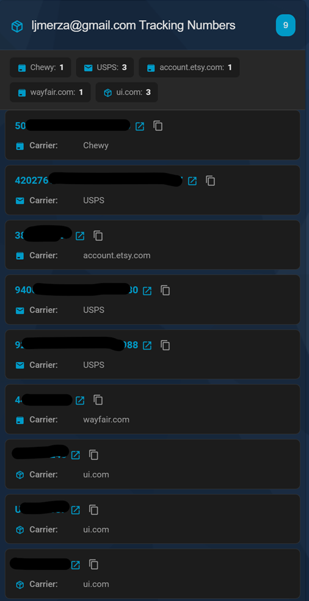

# Tracking Number Card

A modern, customizable Home Assistant Lovelace card for displaying package tracking numbers with clickable links. Requires [tracking-numbers](https://github.com/ljmerza/tracking-numbers) custom integration

## Features

- Clean, modern card design following Home Assistant design language
- Visual configuration UI editor
- Clickable tracking numbers that open package tracking pages
- Copy tracking number to clipboard with one click
- Add manual tracking numbers directly from the card
- Remove or hide entries with a single click
- Display carrier information with icons
- Show relative timestamps (e.g., "2 hours ago")
- Summary statistics by carrier
- Fully customizable sorting and display options
- Responsive design for mobile and desktop
- Full theme support (dark/light mode)
- Empty state handling
- Stylized console logging with version info

## Installation

This card requires the [tracking-numbers](https://github.com/ljmerza/tracking-numbers) custom integration to be installed and exposing a sensor with tracking data. HACS is the recommended way to install the card.

## Installation through [HACS](https://github.com/hacs/integration)

1. Open **HACS** in Home Assistant.
2. Go to **Frontend**, click **Explore & Download Repositories**, and search for **Tracking Number Card**.
3. Select it, click **Download**, and choose the latest version.
4. Hard-refresh your browser (Ctrl/Cmd + Shift + R) to clear the cached module.

HACS automatically registers the Lovelace resource `/hacsfiles/tracking-number-card/tracking-number-card.js`. If your dashboard is in YAML mode, add it yourself under **Settings → Dashboards → Resources** as a **JavaScript Module**.

## Manual installation

1. Download `tracking-number-card.js` from the [latest release](https://github.com/ljmerza/tracking-number-card/releases/latest).
2. Copy it to `config/www/tracking-number-card.js`.
3. Go to **Settings → Dashboards → Resources → Add Resource**.
4. Set the URL to `/local/tracking-number-card.js` and the type to **JavaScript Module**.
5. Hard-refresh your browser.

### Configuration Options

| Option | Type | Default | Description |
|--------|------|---------|-------------|
| `entity` | string | **Required** | Entity ID with tracking number data |
| `title` | string | Entity friendly name | Custom card title |
| `show_summary` | boolean | `true` | Show summary statistics by carrier |
| `show_carrier` | boolean | `true` | Display carrier information for each package |
| `show_origin` | boolean | `true` | Display retailer or sender information when available |
| `show_dates` | boolean | `true` | Show last updated timestamps |
| `sort_by` | string | `first_seen` | Sort field: `first_seen`, `carrier`, or `tracking_number` |
| `sort_direction` | string | `desc` | Sort direction: `asc` or `desc` |
| `max_items` | number | unlimited | Maximum number of packages to display |

## Contributing

Contributions are welcome! Please feel free to submit a Pull Request.

## Release Process

- Update the version in `package.json` and commit your changes.
- Create and push a version tag, for example `git tag 4.2.2 && git push origin 4.2.2` (a `v`-prefixed tag such as `v4.2.2` also works).
- The GitHub Actions workflow builds the distribution files and publishes a release with the generated assets.

## License

MIT License - see LICENSE file for details

## Support

For issues, feature requests, or questions:
- GitHub Issues: [tracking-number-card/issues](https://github.com/ljmerza/tracking-number-card/issues)
